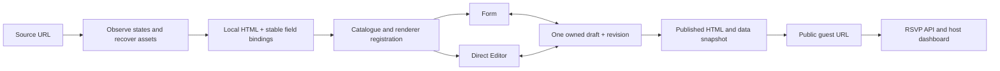

# FindMyInvite template import — standalone agent runbook

Updated 17 September 2026. Read this file first when starting a new task with only a source URL. Paths below are relative to the Git repository root, not the surrounding Codex workspace. Inspect current code before editing: this document describes the implementation at this date.

## Mission and product context

FindMyInvite (FMI) lets hosts select an invitation design, personalize it, publish a guest URL, and collect RSVPs. Production: https://findmyinvite.com. Repository: https://github.com/hardwin/findmyinvite, production branch `main`, Vercel project `findmyinvite` under `hardwins-projects`. Supabase project reference: `qqvcptjkfcjkwbkookcm`. These identifiers are not credentials.

Import a source design into the FMI catalogue with locally served media, editable content, and working publication. Do not embed the source website or depend on its backend. The iframe in our Editor is our own sandboxed HTML preview, not a remote-site embed.

The user values visual fidelity, mobile usability, fast editing, existing assets, and low execution cost. Reuse available assets; do not generate substitute artwork. Record missing assets and adaptations. Ask before an expensive manual reconstruction. Never claim pixel identity or a verified flow without evidence. Download access alone does not establish redistribution rights: record provenance and any supplied licence/permission; do not invent one. Do not bypass paywalls, private endpoints, access controls, or security interstitials.

## Technologies and responsibilities

| Layer | Technology / files | Responsibility |
|---|---|---|
| Application | React 19, TypeScript, Vite 6, `src/App.tsx` | Routes, catalogue, editor and public pages |
| Existing cinematic designs | Three.js, `src/Invitation.tsx` and scene components | Native React invitation renderer |
| Imported HTML designs | `public/studio/templates/<id>.html` | Local markup, CSS, approved interaction JavaScript |
| Renderer registry | `public/studio/renderers.json` | Identifies HTML templates consistently on client and server |
| Form / direct editor | `src/studio/TextEditor.tsx` | Same draft and autosave in both modes; no LLM needed |
| HTML preview bridge | `src/studio/StudioPreview.tsx` | Data binding, click editing, section navigation, RSVP messages, sandbox |
| Common field schema | `public/studio/fields.json` | Common form labels, types, limits and section names |
| API / validation | `api/studio.mjs`, `server/studio-policy.mjs`, `server/core.mjs` | Ownership, data limits, revisions, template validation, publication |
| Persistence | Supabase Postgres | Catalogue, drafts, versions, publications, invitations and responses |
| Hosting | Vercel, `vercel.json` | Static assets, API functions and production deployment |
| Validation | Node test runner, TypeScript, `parse5` | Contract/security tests, types, HTML validation |
| Separate AI Studio | `/studio`, OpenAI and workspace infrastructure | Code changes; NOT required for a Form/Editor import |

## How the form knows what to edit

It does **not** scrape arbitrary divs or guess fields at runtime. The form is currently common-schema based, not a fully template-specific schema engine. The importer manually binds the design to canonical data keys. Different HTML structures work because their bindings are the same:

```html
<section data-section="hero">
  <h1><span data-field="groom"></span> &amp; <span data-field="bride"></span></h1>
  <p data-field="date"></p>
</section>
```

The form changes `data.groom`; the preview bridge updates every `[data-field="groom"]` using `textContent`. The direct Editor changes the same key. No model call is needed. A new custom field is NOT supported merely by adding an HTML attribute: extend the type, defaults, schema, server validation, editor controls and publication handling together.



## 1. Establish the workspace safely

1. Locate the Git root. In the original laptop workspace it was `outputs/findmyinvite`; a fresh clone will usually already be the root.
2. Read applicable `AGENTS.md` instructions, `package.json`, this file, and current relevant code. Use `rg --files` and focused `rg` searches.
3. Inspect `git status`, branch and current remote `main`. Preserve unrelated/uncommitted work. Do not reset, force-push or upload the entire working directory indiscriminately.
4. Confirm GitHub, Vercel and Supabase access only when needed. Use environment variables or authenticated connectors; never put keys in chat, source, docs, URLs or logs.
5. Review relevant installed skills for browser verification, Supabase and deployment when using those capabilities.
6. Agree a unique slug, collection, source and scope. Existing `royal-heritage` and new `royal-heritage-wedding` are different designs; never reuse an ID to replace an unrelated template.

## 2. Locate and inspect the actual demo

1. Open the provided source page using supported browser tools.
2. Navigate its visible category/filter controls and preview action. A catalogue card or screenshot is not the complete invitation.
3. Inspect the rendered iframe `src`/visible link when the demo is framed. Open that observed URL directly if accessible. Do not guess private APIs or enumerate unrelated URLs.
4. Record source page, demo URL, title, date inspected, desktop/mobile dimensions, sections, opening states, typography, colors, layouts, media crops and interactions.
5. Capture closed, opening and revealed states; scroll through every section. Exercise gallery, music, calendar, map and RSVP where present without submitting private information to the source.
6. Distinguish decoration from source customer photos/personal data. Use FMI sample data for the new demo.

Royal Heritage example: Bigdates wedding catalogue → Luxury → Royal Heritage Wedding → Preview. Observed public demo: `https://bigdate.events/wd-bgifh`, mobile presentation `?force_device_type=mobile`.

## 3. Recover and inventory assets

1. Inventory assets observed in the loaded page, including CSS backgrounds, pseudo-elements, fonts and video posters. Scroll before inventorying lazy-loaded sections.
2. Prefer original images/media and styles. Use supported page asset downloads or a normal authorized HTTP downloader when available. Browser asset tooling may support only images, CSS, fonts and video; do not assume it can save JavaScript/audio.
3. Download a small focused set first. Avoid retrying blocked fonts or long failing batches. Inspect download success/failure records.
4. Save product assets under `public/assets/<template-id>/`. Keep raw reference artifacts outside the shipped bundle, or in a clearly labelled review directory.
5. Create `docs/template-imports/<template-id>.assets.json`: source URL → local path → SHA-256, plus retrieval notes. Verify content/type and image dimensions. Preserve original media bytes where practical.
6. Rewrite CSS `url(...)` to local `/assets/...` paths. Remove external `@import`, analytics, trackers and remote runtime calls. Reuse existing identical local fonts before downloading duplicates.
7. Preserve scoped selectors when adapting compiled CSS (for example Svelte's `.svelte-...` classes). Keep matching scope classes in recreated markup.
8. Do not transplant a third-party app bundle wholesale: it can contain source-specific routing, API calls, tracking, licensing checks and customer data. Recover presentation and implement the required interactions against FMI's contract.
9. Document missing music, fonts, original opening assets or unrecovered interactions. Public accessibility is not a licence assertion.

## 4. Choose the renderer and implement the contract

For a self-contained imported layout use the HTML renderer. Native React templates remain supported; don't convert every existing template during an import.

Create `public/studio/templates/<id>.html`, optionally with a reproducible generator such as `scripts/build-royal-heritage.py`. Keep CSS inline in the template because current validation rejects linked stylesheets. All images/font/media URLs must satisfy the existing local-asset policy.

Required/common bindings:

| Attribute / element | Meaning |
|---|---|
| `data-section="hero"` | Opening/names/date navigation target |
| `data-section="welcome"` | Invitation message and family information |
| `data-section="timeline"` | Celebrations/program navigation target |
| `data-section="gallery"` | Photo section |
| `data-section="venue"` | Venue/address navigation target |
| `data-section="rsvp"` | Guest response section |
| `data-field="groom"`, `bride`, `date`, `time` | Canonical couple/event values |
| `data-field="welcome"`, `groomDetails`, `brideDetails` | Message/family wording |
| `data-field="venue"`, `address` | Location content |
| `data-photo="0"` through `3` | Up to four current library-photo slots |
| `data-events="timeline"` / `preEvents` | Bridge renders event cards from arrays |
| `data-editor-text="text-7001"` | Stable static-wording override ID, numeric suffix 1–4 digits |
| `<form id="fmi-rsvp">` | Intercepted by the parent bridge and sent to FMI's RSVP API |

Inspect a working template and the current RSVP server validator for exact input names and allowed values. Do not assume a source RSVP payload matches FMI. The bridge generates `.fmi-event-card` elements with title, time and description: style these within the imported design. All six navigation sections should exist; optional additional sections can be added with conscious bridge support.

Use explicit static wording IDs in new templates. Never renumber existing published template IDs casually: saved `textOverrides` depend on them. The bridge also supports legacy automatically numbered leaf text. Nested text with children may need a dedicated leaf span. Exclude countdown numbers and control labels from accidental editing.

Template scripts can read `window.fmiData` after the bridge update and listen for `document` event `fmi:updated`. This is how countdowns, map links and galleries react to edits. Use DOM text assignment, not unsafe user HTML. Preserve reduced-motion support, touch controls, keyboard focus, overflow handling and a replayable opening. Editor mode should reveal editable content instead of trapping it behind a gate.

The iframe uses `srcdoc`, an isolated sandbox and a restrictive CSP. Network calls belong to the parent API layer. Do not weaken the sandbox to make an import work. Public local font files need appropriate CORS headers because the sandbox has an opaque origin; `/assets/fonts/*` has a public-read CORS header. This does not grant API access.

Current constraints: 4 library photos, allowlisted music paths, bounded text lengths and event arrays. A new upload capability, arbitrary remote music URL, custom section or arbitrary HTML field requires a separately designed full-stack change.

## 5. Register the design everywhere required

1. `src/data.ts`: add unique ID, visible name, description, local image path, collection flag, badge and color. Use empty `video` if no video exists. Do not reuse a misleading source price.
2. `server/core.mjs`: add the ID to the server template allowlist.
3. `public/studio/renderers.json`: add ID to `htmlTemplates`. Client and server share this registry.
4. `public/studio/fields.json`: add template metadata under `templates`; review common fields. This metadata alone does not create a template-specific form.
5. `src/studio/TextEditor.tsx`: inspect template defaults, especially music. Existing generic defaults should not claim recovered music where none exists.
6. `src/studio/TempleDemo.tsx`: verify query-selected HTML demo, appropriate defaults, collection and Choose this design link. Despite its historical name, it now handles all registered HTML demos.
7. `src/App.tsx`, `src/studio/StudioPreview.tsx`, `api/studio.mjs`: verify routing, publication renderer and server baseline use the shared registry. Avoid adding another hardcoded two-template condition.
8. Add an idempotent catalogue DML file under `supabase/`, following `006_royal_heritage_wedding.sql`. Insert/upsert `template_catalog` with matching ID, collection `royal`, metadata, sort order and publication flag.
9. Execute that DML against the intended Supabase project after validating the deployed code. Use a migration tool for DDL; this catalogue insert is DML. Do not change RLS or expose service credentials.
10. Do NOT add the template to `PILOT_TEMPLATES` merely to make Form/Editor work. That list explicitly enables coding-agent operations and has additional requirements. `HTML_TEMPLATES` and `EDITOR_TEMPLATES` are separate concerns.

## 6. Preserve the guest journey

Routes: `/templates` → design choice → `/form?template=<id>&type=wedding&new=1` or `/editor?...` → `/{mode}?draft=<uuid>` → publish → `/<slug>`; management uses `/manage/<slug>`. `/studio` is separate.

Both modes use `TextEditor.tsx`, the same owned draft and revision. Save before switching. Never recreate the draft when toggling modes. Current catalogue creation can resume a saved draft matching design/type, guards concurrent creation, and shows a focused retry state on error. Keep these protections.

Guest draft access is stored in local browser storage, with a server-side ownership hash. Do not include that token in docs or commit it. A copied `?draft=` URL alone is not cross-device authentication. Published HTML/data is a snapshot; editing a draft should not silently rewrite the public invitation until republished. Preserve `studioId` so public rendering and management reopen the correct pipeline.

## 7. Validate locally, then in production

From repository root:

```sh
python scripts/build-royal-heritage.py  # only for this generated template
npm run test:server
npm run build
npm run preview
```

The scripts include Node symlink-preservation flags needed by the original workstation's dependency runtime. Use `npm ci` in a normal clean environment. If local Vite development optimization fails on restricted external dependency junctions but production build succeeds, use the built preview; don't spend time rewriting dependencies solely for that workstation issue. A local static preview does not prove production API access.

Add focused tests following `tests/server-template-import.mjs`: renderer registration, no unintended AI access, `validateTemplate(html, html)`, local asset existence and absent source tracking/runtime references. Test data binding and persistent workflows in a browser, not only with string assertions.

Acceptance checklist (record pass/fail/not checked):

1. Royal catalogue card appears with the correct design name and image.
2. Preview opens the selected design, not another renderer.
3. Opening action reveals all content and can be replayed by reopening.
4. 390×844 layout has no horizontal overflow or clipped controls.
5. 1440×900 layout has appropriate crops and readable text.
6. All local images and fonts load; missing audio is explicit.
7. Form creation produces one draft with the selected template.
8. Change names, message, date and venue; save and reload.
9. Switch Form → Editor → Form with the same draft and values.
10. Click a static heading, edit it, reload, and verify its stable override.
11. Program/pre-event edits render in the appropriate styled section.
12. Gallery buttons/swipe, countdown, maps and calendar work where included.
13. Publishing produces the expected public template and edited values.
14. A synthetic RSVP appears in host management; no source API is contacted.
15. Existing Royal Temple, one native Royal design and draft ownership protections still work; final build/tests pass.

## 8. Commit, deploy, verify and roll back

1. Inspect the final diff and file list. Include downloaded binary assets, generated HTML, registry, catalogue SQL, tests and documentation. Exclude `.env`, credentials, node_modules, dist, personal data and temporary browser bundles.
2. Commit to the authorized branch; if authorized, push `main` to trigger the linked Vercel production deployment. Verify the exact commit is Ready, not merely that an old production page loads.
3. If shell networking/.git writes are restricted, an authenticated GitHub connector can create blobs (base64 for binaries), a tree based on fresh main, a commit with that main parent, and a non-forced main ref update. Fetch main immediately before this operation. Preserve unrelated current remote content. Never upload a stale whole checkout.
4. Execute the catalogue DML in Supabase and verify the row. A repository SQL file is not evidence it ran.
5. Verify live catalogue, demo, creation, switching, persistence and publication using browser UI. Avoid repeated new drafts: creation currently has a 6/minute network burst limit and 500/hour network limit; edits are separate.
6. Report live URLs, commit, actual checks and remaining gaps. Keep a source-specific import report with asset provenance.
7. If broken, set only this catalogue row `published=false` to hide new selection, and/or roll back the Vercel deployment to the previous known good commit. Preserve existing owned drafts/publications. Do not delete customer data as a rollback technique.

## Reusable task prompt

> Read `docs/TEMPLATE-IMPORT-WORKFLOW.md` and applicable repository instructions. Import the invitation at SOURCE_URL as DISPLAY_NAME with unique ID TEMPLATE_ID into COLLECTION. Inspect the actual public demo, recover available original assets, adapt it to our shared Form/Editor data contract, add catalogue and renderer registrations, and document provenance and gaps. Preserve existing saved invitations and security boundaries. Verify mobile/desktop, mode switching, persistence and publication. Use no AI calls for ordinary field editing, and ask before costly reconstruction. Deploy only within the authorization given in this task. Deliver the live preview, commit and import report; distinguish tested from unverified behavior.

## Known limits of “any URL”

This is a repeatable engineering workflow, not a universal one-click scraper. Canvas/WebGL scenes, server-rendered private data, cross-origin media, restricted assets, compiled runtimes and different section models may require adapters or remain unrecoverable. State that early. Current form fields are shared; importing a visibly different design does not automatically infer new inputs. The mapping work is what makes reliable cross-template editing possible.
