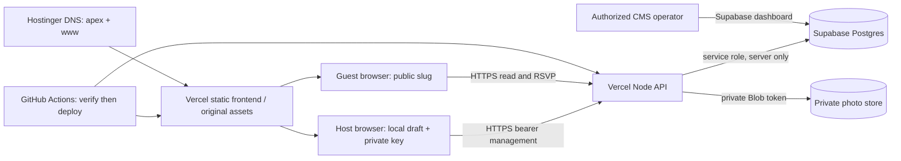
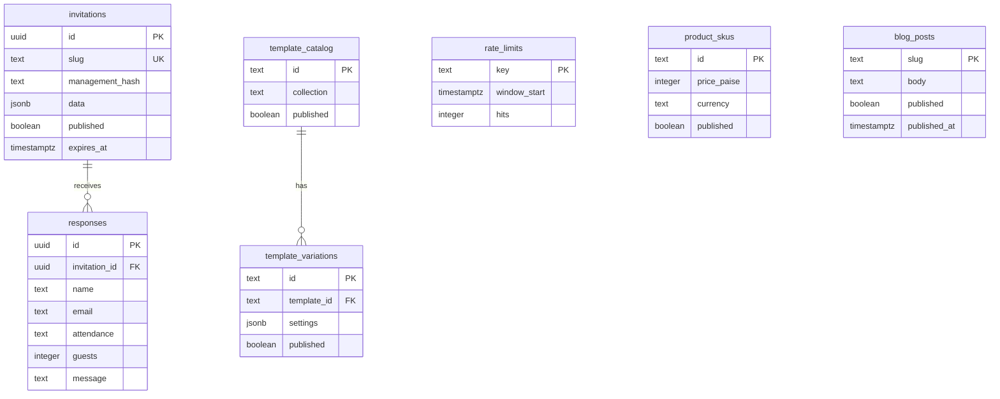

# Architecture and data model · v0.9 → guest v1.0

**Implemented stack:** React 19 + TypeScript, Vite, Three.js; Vercel static hosting and Node API functions; Supabase Postgres through the REST API; private Vercel Blob; GitHub Actions. This document describes implementation, not proposed accounts or payments.



**Trust boundaries:** public browsers never receive the service-role or Blob token. Application functions authorize ownership. Supabase service-role access bypasses RLS; therefore backend authorization is essential, with RLS/revoked browser grants providing additional protection. Do not introduce `auth.uid()` policies as if guests had Supabase Auth sessions. See [Supabase RLS guidance](https://supabase.com/docs/guides/database/postgres/row-level-security).

## Publish and management model

```mermaid
sequenceDiagram
  participant H as Host browser
  participant A as Vercel API
  participant D as Supabase
  participant B as Private Blob
  H->>H: Generate 256-bit key; save locally before request
  H->>A: Create slug + event data + management key
  A->>A: Check window, limits, validation, published template
  A->>D: Insert unpublished draft with SHA-256 key hash
  A-->>H: Draft slug (same-key retries are idempotent)
  H->>A: Upload photos with bearer key
  A->>B: Validate type/signature/size; store private slots
  H->>A: Update data and published=true
  A->>D: Save invitation
  H->>H: Save recovery link; share public slug only
```

Public route: `/<slug>`. Management route: `/manage/<slug>#<private-key>`. The fragment is consumed into browser storage and removed from history; subsequent API calls use an Authorization bearer header. Hash-only server storage means no email/password recovery exists. Anyone holding the raw key can manage the event and read RSVP personal data. Anyone holding a published public URL can see its public content; there is no guest passcode.

Publication, public visibility and free creation are separate rules. The offer gates new drafts. Existing invitations remain editable after offer expiry. Guest reads require published state and an unexpired event. Expiry is the event start in IST plus an assumed 3-hour duration plus 30 days; changing the event date recalculates expiry. Unpublishing a CMS template prevents new use; it does **not** revoke existing invitations or remove static assets.

## Logical schema



This is a logical summary; SQL files define exact types/constraints. Invitation template selection lives inside JSON, not a database foreign key. SKU association uses collection (`classic` / `royal`), not an orders table. Deleting invitations cascades response rows. `template_variations` is prepared; end-user variation controls are deferred. Blog bodies render as text, not executable HTML. Rendering code recognizes supported template IDs; CMS is not an arbitrary template-code execution system.

## API contract summary

| Endpoint/action | Authorization | Effect |
| --- | --- | --- |
| GET `/api/invitations?action=config` | Public | Configured flags, server time, offer bounds, list prices |
| POST `action=create` | New strong key in body | Validate and create unpublished draft; same-key same-slug retry returns existing draft; other key conflicts |
| GET `action=read&slug=…` | Public | Published, unexpired invitation only |
| GET `action=manage` / `responses` | Owner bearer | Host data / newest 1,000 RSVP rows and `hasMore` |
| POST/PUT `action=update` | Owner bearer | Validated edits and publication state; verifies referenced photo existence |
| DELETE `action=delete` | Owner bearer | Delete four Blob slots, then invitation/response data |
| POST `action=rsvp` | Public published event | Validate response; rate limit; persist |
| `/api/media?slug=…&slot=…` | POST/DELETE owner; GET conditional | Private uploads; public GET only if published/unexpired and exact slot URL referenced |
| GET `/api/content?kind=templates` | Public | Published templates, SKUs, variations |
| GET `/api/content?kind=blog[&slug=…]` | Public | Published posts with publication time reached |

JSON errors carry HTTP status; do not convert cloud failures into a false success backed only by localStorage. Reserved routes and unique slug constraints prevent ordinary path collisions. Refer to `server/core.mjs` for exact validation, lengths and statuses.

## Limits and consistency

- Four uploaded photo slots; JPEG/PNG/WebP signature checks; backend 1 MiB maximum each, UI slightly stricter at 1,000,000 bytes. No virus-scanning service is implemented.
- Creation 10/hour per request identity; RSVP 30/hour per identity and 10/hour per invitation/identity; uploads 40/hour per invitation/identity. Atomic SQL limiting uses a keyed request-identity hash; production trusts Vercel's forwarded-IP header and fails closed if unavailable.
- Host inbox returns the newest 1,000 responses. Additional rows remain in DB; pagination/export UI is deferred.
- Uploads and DB publication are separate operations. A failed upload/update can leave an unpublished draft or stored bytes; retries and cleanup need explicit handling. Deterministic photo-slot replacement is not an atomic versioned publish of the whole invitation.
- Browser keys and old drafts are origin-scoped. Moving from `.vercel.app` to the custom domain does not copy localStorage. A valid recovery key can manage on the new origin; local drafts require explicit migration/publication.
- No automatic expired-media cleanup, rate-limit cleanup, multi-region failover, verified backup schedule or load-test capacity claim exists.

## Repository and deployment boundaries

`supabase/001_guest_launch.sql`, then `cms/schema.sql`, then `cms/seed-templates.sql` were applied manually to the provisioned instance. They are **not** registered in Supabase CLI migration history. Do not run them blindly on the live database; the initial invitation table creation is not idempotent. New schema work needs a backup, inspected baseline and a separately reviewed forward migration.

All environments currently share DB and Blob. Separate staging is the preferred next operational improvement. Production deployment builds with production environment values through GitHub Actions. Environment edits apply only to new deployments; see [Vercel environment variable documentation](https://vercel.com/docs/environment-variables). Static source assets ship with the frontend; private uploads are a separate security boundary. `/review` artifacts are excluded. Invitation social previews still use generic SPA metadata; personalized server-rendered unfurls are deferred.
