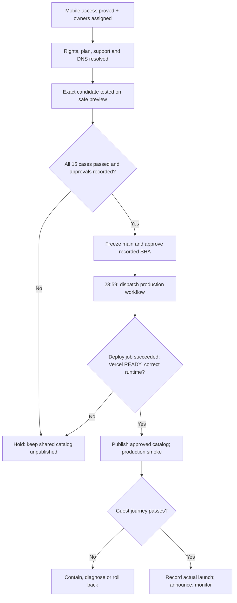

# Release runbook · mobile-operated v1.0

**Target:** 14 September 2026, 23:59 IST (18:29 UTC). **Current disposition: NO-GO pending gates.** Read [status](STATUS.md), [access checklist](ACCESS-AND-TAKEOVER.md), and [15 tests](PREDEPLOY-15.md). Record every operational decision in [RELEASE-RECORD.md](RELEASE-RECORD.md). No automated midnight launch is configured.

## Authority and sequence

The founder authorizes launch; the named Release Manager operates a single deployment lane. QA provides test evidence, Engineering confirms commit/build, Security/Data confirm access and recovery, Product/Business clear catalog/rights/support, and Finance clears hosting/spend. One person may hold multiple roles but must record each decision. A blocked launch is a supported outcome; do not remove validation or publish uncleared assets to meet the clock.



## Before leaving the laptop

Complete [ACCESS-AND-TAKEOVER.md](ACCESS-AND-TAKEOVER.md) now. The phone must open the private repository, start a Cursor **cloud** agent, inspect Actions, manage the release variable, reach Vercel/Supabase/Hostinger with 2FA, and reach a fallback operator. Launch through cloud/CI; a Cursor desktop session stops being useful when the laptop sleeps. Copy only sanitized evidence into Git, never cached CLI credentials.

## Pre-release preparation

1. **Freeze scope.** Fix only blocking defects, business/policy details, deployment configuration and cleared catalog selection. No accounts, checkout, AI features or schema rewrite tonight. Change package/lock versions to `1.0.0` only in the reviewed release candidate; retain v0.9 history/tag.
2. **Resolve access and business gates.** Complete G02–G08 in the risk register; record approvals and approved design IDs. Review hosting charges with the authorized billing owner. Token replacement must be tested before revoking the prior credential.
3. **DNS.** In Hostinger DNS, recheck Vercel's current domain instructions, replace the parking apex A record with both recommended A values below and replace the current www CNAME. Preserve MX/TXT and nameservers; check conflicting A/AAAA records against Vercel's recommendations. Do not invent another IP. Verify Vercel domain validation, HTTPS and www → apex 308 from the phone's mobile network.

| Type | Host | Last verified recommendation |
| --- | --- | --- |
| A | `@` | `216.198.79.1` |
| A | `@` | `64.29.17.1` |
| CNAME | `www` | `add4a49499e0845e.vercel-dns-017.com` |

Use TTL 300 if offered, otherwise the provider default. Domains are already attached to this Vercel project; do not duplicate them. DNS propagation/TLS may exceed the remaining window. A working `.vercel.app` URL is not proof of custom-domain readiness.

4. **Schedule.** Production project values must be `PROMOTION_START_AT=2026-09-14T23:59:00+05:30` and `PROMOTION_END_AT=2026-10-14T23:59:00+05:30`. Code defaults and display copy agree. Old deployed runtime remains 21:00; keep the shared catalog unpublished until the final production runtime is verified at/after 23:59. Redeployment changes aliases but an older deployment URL may remain reachable: do not rely only on replacing the alias to prevent early creation.
5. **Safe acceptance environment.** Preferred: provision a separate nonproduction Supabase/Blob pair with approved operator access and budget, apply schema only to that empty database, publish only cleared test designs there, and connect **preview only** to those resources. Set a preview-only active offer window for fresh-create tests; production values remain unchanged. This is required work, not already-provisioned staging. If it cannot be completed, mark affected cases BLOCKED and hold launch. Do not use an administratively seeded draft as a substitute for fresh creation. Do not open the shared production catalog early to facilitate a test. After testing, restore preview offer dates if that candidate is used for visual comparisons; build production with production values, never promote a testing-window preview blindly.
6. **Verify CI.** Keep `ENABLE_PRODUCTION_DEPLOY=false`. Dispatch `ci.yml` with target `preview` from `main`, inspect both jobs and resulting URL/SHA, run the 15 cases, and retain sanitized evidence. If a test fails, fix on a branch, merge, and recheck affected behavior plus the normal CI verification. New pushes can cancel a running same-branch workflow; freeze `main` when final verification starts.
7. **Prepare recovery.** Record compatible prior deployment, current catalog publication flags, schema baseline, secured SQL/Blob backups and a restore rehearsal. Neither a Git tag nor a Vercel rollback backs up user data. See post-ops below. Record a named backup operator available by phone.

## GitHub mobile release path

Use the GitHub web UI in the phone browser (desktop site view if settings are hidden):

1. Open [repository Actions](https://github.com/hardwin/findmyinvite/actions), confirm the reviewed `main` SHA and successful verify run. No new pushes until deployment completes.
2. Open repository **Settings → Secrets and variables → Actions → Variables**. Set **`ENABLE_PRODUCTION_DEPLOY` to `true`** only after all gates and founder release instruction.
3. Open **Verify and deploy → Run workflow**; branch `main`, target **`production`**. Inspect the selected inputs. Dispatching `preview` does not release to production.
4. Wait for **verify and deploy jobs** to succeed. If deployment is skipped, the release did not happen even if the workflow is green. Check variable value, branch and event conditions; do not bypass checks with an unverified direct deploy.
5. In [Vercel deployments](https://vercel.com/hardwins-projects/findmyinvite), confirm READY, target production, exact Git commit, production alias and domain attachment. Record deployment URL and ID. Confirm `/api/invitations?action=config` returns configured/uploadsConfigured true, the 23:59 bounds, and correct server-time active state.
6. At/after 23:59 and only after runtime verification, publish **only approved catalog IDs** in Supabase Table Editor; record old/new values. Never bulk-publish all rows. Re-fetch `/api/content?kind=templates` and compare to the approved ID list. CMS changes are live immediately and are not part of a Vercel rollback.
7. Run the production smoke sequence below. If it passes, record actual release timestamp, tag the released commit `v1.0.0`, and let Marketing publish approved launch messaging. If it fails, keep the announcement on hold and contain the failure.
8. Set **`ENABLE_PRODUCTION_DEPLOY=false`** after the run, including a failed run. This returns delivery to intentional manual release; it does not stop the live application. Record the setting in the release log.

For an already authenticated cloud shell, equivalent Actions operations are:

```sh
gh variable set ENABLE_PRODUCTION_DEPLOY --body true --repo hardwin/findmyinvite
gh workflow run ci.yml --ref main -f target=production --repo hardwin/findmyinvite
gh run list --workflow ci.yml --branch main --limit 5 --repo hardwin/findmyinvite
# Read the selected run ID, then inspect it; do not guess which run was dispatched.
gh run view RUN_ID --repo hardwin/findmyinvite
gh variable set ENABLE_PRODUCTION_DEPLOY --body false --repo hardwin/findmyinvite
```

`RUN_ID` is a placeholder. These commands do not authenticate Cursor or grant it permissions; use the mobile GitHub UI if its token lacks Actions or variable access. Do not put a PAT in a command argument/chat. Do not add a second Vercel Git auto-deploy path that bypasses this workflow; inspect existing integration settings before release.

## Production smoke and first hour

Use a unique synthetic event slug, a future IST event date and a nonpersonal photo. On the **custom domain**, create and publish, download recovery, reopen from another browser/device, edit and reload, submit a guest RSVP, verify the private inbox, unpublish, republish and delete the test event. Check photo revocation and direct-route refresh. Record outcomes without keys, email addresses or original photo data. Confirm homepage/mobile controls, offer copy, support link, public noindex behavior where configured, and `/review/index.html` exclusion.

| Window from actual READY | Action / responsible role |
| --- | --- |
| 0–15 minutes | QA + Release: smoke above, errors, DNS/TLS, configuration, catalog and access checks |
| 15–60 minutes | DevOps + Support: inspect error trends, 429s, storage failures, failed creates and support reports; validate configured budget alerts |
| 1–24 hours | Data + Product: reconcile invitation/RSVP counts, inspect orphan/expiry behavior and restore readiness; review measured funnel if instrumentation exists |
| Next business day | Release + all leads: written incident/defect review, operational ownership, separate staging, retention/payment backlog |

These are operator tasks, not scheduled monitors already installed. Proposed incident triggers: any unauthorized management/data exposure or data loss is SEV1; repeat confirmed publish/RSVP failure is SEV2; cosmetic issues with a working journey are SEV3. Release Manager coordinates; Security leads exposure incidents. Capture UTC time, deployment, redacted request ID/status and impact. Assign actual contacts before launch.

## Containment and rollback

1. Stop announcements and new releases; set the Actions variable false. **This alone does not stop creation or existing traffic.**
2. For creation abuse/failure, snapshot template publication flags and set the relevant/all template rows unpublished through the authorized CMS operator. This blocks new template creation; existing invitation edits/reads and RSVPs remain available. If the issue affects existing data access, apply an authorized Vercel access/maintenance containment as appropriate; catalog closure is insufficient.
3. Inspect logs without bearer keys or personal response bodies. Record failing deployment and database state before changes. Coordinate credential revocation if exposure is confirmed.
4. In Vercel use rollback to a **recorded compatible production deployment**, or an authenticated `vercel rollback <deployment-url-or-id>` following current provider instructions. Inspect plan limits: Hobby permits only the immediately previous production deployment. Rollback changes routing, not Supabase/Blob data. [Official rollback guide](https://vercel.com/docs/deployments/rollback-production-deployment).
5. Recheck offer bounds, old/new URLs, catalog gating, guest reads, management and RSVP after rollback. The old candidate has a 9 PM schedule and is not a schedule-correct fallback before the postponed launch. Keep catalog closed until a corrected release is ready.
6. Do not automatically re-run initial SQL, restore an old database over new responses, drop tables, delete user photos, or point DNS back to parking. Data recovery requires a reviewed scope, secure backup and affected-record reconciliation. Restore into a separate database first; application rollback and data recovery are distinct operations.
7. Resolve root cause on a branch, run affected tests and CI, review release record, then redeploy deliberately. Document actual recovery time and any remaining impact; avoid claiming zero data loss until verified.

At offer expiry **14 October 23:59 IST**, new creation stops unless a separately verified commerce release changes eligibility. Existing users are not charged automatically. Assign an owner now to handle expiry communication and payment readiness; no automatic reminder exists.
