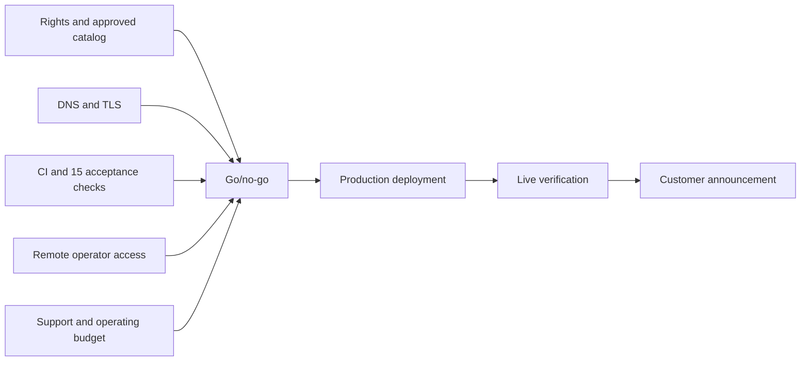

# Program Manager — cross-team launch dependencies

Coordinate the business, engineering and operational work needed for **14 September 2026, 23:59 IST**. The target is conditional; no automatic launch scheduler is configured. A mobile deployment command may take minutes to build and become READY.

## Accountability map

| Dependency | Named accountable person | Completion evidence |
| --- | --- | --- |
| Business rights, identity and budget | TO ASSIGN — business owner | Written approval |
| Technical readiness and provider access | TO ASSIGN — CTO/platform lead | Release checks and remote access |
| Customer communication and support | TO ASSIGN — CMO/support lead | Approved copy and staffed contact |
| Consolidated go/no-go | TO ASSIGN — Release Manager | Release issue decision |

## Dependency model

## Before, during and after launch

**Before:** maintain one dependency register linked from the [handoff index](../index.md). Current unresolved items include domain configuration, rights/catalog, real support/business details, Vercel plan suitability, backup arrangements and launch staffing. Provider or business approvals are not coding tasks; assign them to actual people.

Confirm all operators can reach GitHub, Vercel, Supabase and Hostinger from mobile or a cloud session. The laptop and ChatGPT will be unavailable. Make two-factor recovery and repository permissions an explicit readiness item; do not store credentials in the issue.

**During:** coordinate the change freeze, blockers and decisions. Keep a single accountable Release Manager and a named backup. Separate “workflow passed,” “deployment READY” and “customer journey works”; they are distinct milestones.

**After:** collect engineering, support, finance and marketing reports into one launch review. Assign remediation ownership for staging isolation, recovery, retention and the future paid release.

## Program controls

Track dependency completion with evidence, unresolved critical risks and decision age. Do not measure success by the number of tasks closed while a release gate remains open. If a required owner or mobile access is missing, escalate to the CEO before the laptop handoff.

Use [runbook](../RELEASE-RUNBOOK.md), [15 tests](../PREDEPLOY-15.md), [risk register](../DECISIONS-AND-RISKS.md), [status](../STATUS.md), and [Cursor entry point](../../../README_CURSOR.md).
