> Access update: the owner requested removal of the shared team-key gate. Studio now opens directly. Draft capability tokens, revisions, sandbox validation and existing agent quotas remain enforced. References below to team-only access describe the earlier pilot. Removing the gate does not bypass network filtering of API requests.

# Love Studio — production pilot handoff

Date: 17 September 2026. Scope: internal team pilot, Royal Temple and Emerald Noir.

## Try it

Open `/studio`, enter the team access key, and choose a design. The shared key is delivered separately in an ignored local file; it is never included in this repository. Use Details for immediate field changes or ask Lovebot for a bounded content/style change. Skip advances to the next section without deleting content. Section visibility is an explicit setting in Details.

The robot is an original procedural Three.js character. The panel is draggable, minimizable, keyboard-aware and compact on mobile. Desktop includes a section sidebar and optional phone-sized preview. Download **Save access** before leaving the device. On a fresh browser, sign in and import that JSON to resume the private draft. Download the separate guest-management recovery link after publishing.

## Architecture

```mermaid
flowchart LR
  UI[React Love Studio] -->|team cookie + draft capability| API[Vercel Studio API]
  API --> DB[(Supabase drafts and versions)]
  API --> Agent[OpenAI managed coding agent]
  Agent --> Sandbox[Hosted workspace / network disabled]
  Sandbox --> Validation[HTML parser + immutable script policy]
  Validation --> Git[GitHub isolated studio branch]
  Git --> DB
  DB -->|explicit publish transaction| Snapshot[Fixed public snapshot]
  Snapshot --> Guest[Guest invitation]
  Guest --> RSVP[Existing RSVP API and dashboard]
```

The preview renders **our locally hosted HTML/assets** in a sandboxed `srcdoc` frame. It does not load or embed Lovlio's website. The sandbox intentionally lacks same-origin privileges. A channel-bound message bridge updates editable text, sections and event lists. Form submission is intercepted; CSP blocks direct form navigation and arbitrary network calls. Parent handlers perform RSVP writes using the existing API.

`public/studio/fields.json` defines editable fields, labels, types, required values and section mapping. It feeds the details form, agent workspace and publication requirements. Template HTML uses `data-field`, `data-photo`, `data-events` and six `data-section` bindings. Template-specific code implements animation, music, scratch, galleries, calendar and directions.

## Real agent, bounded changes

`server/studio-agent.mjs` uses the OpenAI Agents API with its managed coding harness, not a simulated chat response. Each request gets an isolated hosted workspace with template HTML, JSON content and field schema. Network is disabled. No application secrets or Git credentials enter that workspace. The agent edits files, checks them and returns a JSON artifact. Server-side validation rejects added/changed scripts, external assets, dangerous URL/CSS forms and missing data bindings.

Only validated, generic template source and a nonpersonal manifest are committed to `studio/<UUID>`. Personal data remains in Supabase and is bound at rendering. Data-only saves reuse the code SHA. Publishing creates an archive tag and removes the working branch; subsequent edits can recreate the branch. Git writes are non-force, expected-parent checked and recoverable when an identical checkpoint was already committed. No agent changes are merged into main or deployed as server code.

Revision checks and database leases prevent concurrent writes from replacing newer changes. Publication runs in a transaction and keeps the public snapshot unchanged until explicit republishing. Guest management supports responses, recovery, unpublish and delete. Template content must be edited in Studio rather than the older form.

## Operations

Apply migrations `002_studio_pilot.sql` then `003_studio_lease.sql` (both applied to the existing Supabase project). New tables have RLS enabled and no anon/authenticated grants; only the existing service role accesses them. Existing invitation and response formats/routes remain in use.

Server variables: `OPENAI_API_KEY`, `STUDIO_TEAM_KEY`, `STUDIO_GITHUB_TOKEN`, `STUDIO_GITHUB_REPO`, `STUDIO_AGENT_MODEL`, `STUDIO_DAILY_RUN_LIMIT`, plus the existing Supabase/rate-limit configuration. These have been configured for Production and Preview. OpenAI model is `gpt-6-astra`, low reasoning, no subagents. Credentials must never use the VITE prefix. Use a dedicated, least-privilege GitHub credential for the repository when hardening beyond the pilot.

Default allowance is 20 agent starts per rolling 24-hour global window, plus 10 per hour per client. Manual Details edits consume no model tokens. The UI polls and enforces a five-minute run deadline. **This is not a hard monetary cap or independent watchdog:** an abandoned browser can leave a provider session until it completes or a team member reconnects/cancels. Set provider budget alerts and monitor usage. Before public self-service, add scheduled cleanup, stronger per-user quotas and persisted cost accounting. Rotate the OpenAI credential pasted into chat through Vercel and redeploy; do not paste its replacement into documentation.

If a run is busy, reopening its draft reconnects. Cancel preserves the prior revision. A malformed result fails closed. A persistent database failure after successful generation currently requires a retry of the request; there is no durable pending-result inbox. Git's identical-checkpoint recovery prevents blindly overwriting branch history. An archive failure does not undo publication; inspect `archivePending` and archive the matching SHA manually.

Disable new AI requests by setting `STUDIO_DAILY_RUN_LIMIT=0` and redeploying. Rotating `STUDIO_TEAM_KEY` invalidates team sessions. Existing public snapshots remain available. Roll back the Vercel deployment to revert application code; retain the additive tables and data. Old deployments cannot render Studio snapshots, so prefer a forward fix or unpublish affected pilot invitations before an older-code rollback.

## Verification and known limits

- Production build and 55 server tests passed before final browser verification.
- Actual hosted coding-agent run edited Emerald Noir typography, passed server validation and created commit `80643e9fe80733ae4250349efcc50ee9ef618379`.
- Published synthetic example: `/studio-pilot-f5e8e703`.
- Private subsequent save and history restore verified; public snapshot stayed unchanged.
- Mobile Studio checked at 390 × 844 with 280px floating panel and no horizontal overflow. Template checks include both designs, original asset loading and responsive views.
- Final deployment and guest RSVP checks are recorded in `RELEASE-CHECKS.md`.

This release is not the unrestricted public editor. Personal photo uploads in Studio, all catalogue templates, accounts, team roles, durable chat transcript, independent timeout cleanup and automated visual acceptance of model changes are deferred. Library photos and original music work; manual section visibility can leave decorative space in Royal Temple's source scene layout. Opening/motion behavior is recreated where source runtime could not be transferred; exact visual indistinguishability is not claimed. Third-party asset provenance is in `royal-temple-assets.json`; downloading establishes provenance, not a commercial reuse license. Resolve rights before broader commercial distribution.

## Extending the catalogue

1. Add licensed original media and a provenance manifest.
2. Adapt HTML to the binding contract and six section IDs; keep executable scripts reviewed and fixed.
3. Add field/schema overrides when a design genuinely needs different inputs, and enforce them server-side.
4. Register the template in schema and server allowlist; validate the baseline with the policy tests.
5. Verify empty/long fields, hidden sections, mobile navigation, RSVP, calendar and audio.
6. Pilot behind team access before making a design available to customers.
